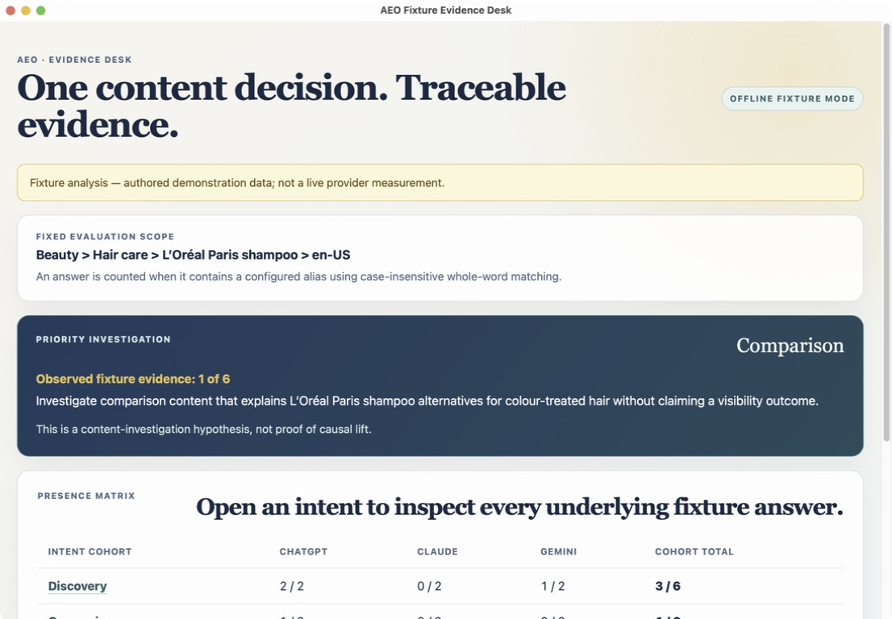
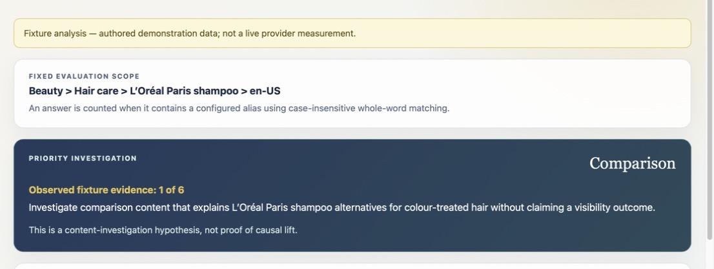

# AEO Evidence Desk

> A small, offline desktop reference app for making one evidence-backed
> answer-engine-optimization decision.



## The problem is not “build a dashboard”

What people typically ask a chat app:

“What shampoo is best for colour-treated hair?” 

A brand team needs to know

1. where Brand appears in those answers, as in at least you should be visible or in the radar of the chat apps. 
2. whether your inclusion is in positive or negative context, and how are you being placed as compared to your competitor
3. and this should help you figure out what to investigate next, and the decision will be how to improve your content game so that 


AEO Evidence Desk helps you narrow down on that answer to trace what should be the next step in your content journey to become positively visible to your consumers. 


## What you can see in the app

The shipped `v0.0.1` demonstrator focuses on one fixed scope:

```text
Beauty > Hair care > L'Oréal Paris shampoo > en-US
```

It contains:

- three customer-intent cohorts: discovery, comparison, and concern-solving;
- limited labelled prompts and responses to help zero in on the content-visibility problem;





## Key Caveat

**This is not live ChatGPT, Claude, or Gemini data.** 

This is just sample data

## Architecture: a small proof today, an engine tomorrow

A minimalist approach - Tauri app starting from the side of "what a decision maker wants to see" and deliberately light on the production architecture - which will depend heavily on the way we source that data in context of the decision maker

```text
IMPLEMENTED IN v0.0.1: offline fixture desk

+--------------------+
| Desktop reviewer    |
| dashboard + drill   |
+--------------------+
          |
          v
+--------------------+
| Typed Tauri         |
| commands            |
+--------------------+
          |
          v
+--------------------+
| Rust fixture core   |
| validate, score,    |
| prioritise, explain |
+--------------------+
          |
          v
+--------------------+
| Embedded fixtures   |
| prompts + answers   |
+--------------------+

```


## Run locally

### Prerequisites

- Rust `1.80` or newer;
- Node.js and npm; and
- the platform prerequisites for [Tauri 2](https://v2.tauri.app/start/prerequisites/).

### Launch the desktop app

```bash
npm --prefix ui install
npm --prefix ui run tauri:dev
```

### Run checks

```bash
cargo test --all-targets --all-features
npm --prefix ui test
npm --prefix ui run build
```


## The production path

The key hypothesis is that if the decision maker finds this kind of insight useful then we can work backwards towards sourcing all of this data from a relevant prompt evidence data base which could be any publicly exposed SaaS tools or creating our own sampling prompt response data set by hitting different APIs. The bigger question here is not as much about how will we engineer this which will definitely include LLM APIs because for LLM as Judge use case. The bigger issue is: can we find something which is actionable for the decision-maker and gives them confidence that their content is improving in the right direction?

A lot of challenges on the engineering side will be emergent in nature, based on the context of how we are allowed to source this data, both in terms of economic feasibility and the technical constraints of the decision maker. 


## Repository guide

- [FAQ](FAQ.md) — plain-English explanation of the client, decision, fixtures,
  LLM judges, limits, and production path.
- [Original assignment brief](docs/D01-problem-statement.md) — the broader
  vertical, client, measurement, validation, and architecture challenge.
- [Research and production design](docs/D02-initial-analysis-20260812.md) —
  taxonomy, provider adapters, scalable schema, validation, and limitations.
- [Executable prototype specification](docs/D03-minimal-fixture-prd-specs.md)
  — exact fixture contract, requirements, and test matrix.
- [Product narrative and screenshots](Narrative/v001/README.md) — the shipped
  screen-by-screen review flow.

## Status

This repository is an educational reference implementation and assignment
artifact. It is a working desktop application, but it is not presented as a
production AEO platform.

The goal is simple: **make one answer-engine content decision more traceable,
not make an unearned promise about changing AI recommendations.**
