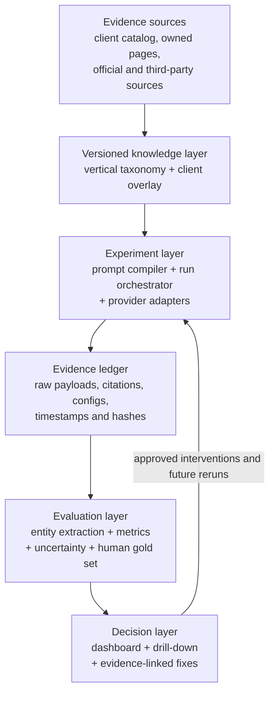
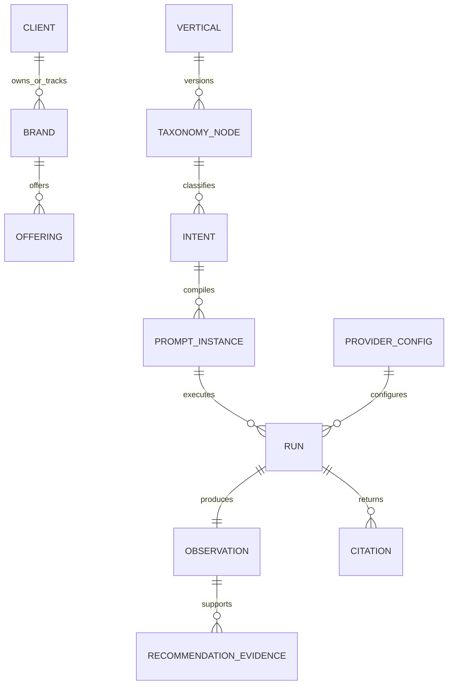

<!-- markdownlint-configure-file {"MD013": false, "MD024": {"siblings_only": true}} -->

# Win the AEO assignment by proving a reproducible decision loop

**Research and scenario analysis — 12 August 2026**  
**Assignment:** [ABC.ai problem statement](docs/problem-statement.md)  
**Decision to make:** Which 48-hour prototype strategy best demonstrates vertical understanding, L’Oréal-specific tailoring, multi-platform measurement, scalable design, actionable fixes, and credible validation?

> **Governing thought:** The strongest submission is not the prototype with the most screens or prompts. It is a small, reproducible, evidence-carrying loop: versioned beauty taxonomy → realistic prompt cohort → official platform runs → raw answers and citations → uncertainty-aware metrics → one traceable recommendation → an honest validation plan.

This document presents decision summaries, evidence, assumptions, and trade-offs. It does not expose private chain-of-thought. Statements labeled **Sourced** are supported by the linked source; statements labeled **Inference** are reasoned recommendations; statements labeled **Prototype target** are acceptance criteria, not achieved results.

---

## Executive decision

Build **Scenario 5: the Evidence-First Golden Slice**. It combines the strongest parts of three narrower approaches:

1. the extensible taxonomy and client overlay from Scenario 1;
2. the provider-neutral measurement adapters from Scenario 2;
3. the provenance and fix traceability from Scenario 3; and
4. the repeated, human-calibrated evaluation protocol from Scenario 4.

The 48-hour demo should cover one deliberately small slice—such as **facial moisturizers for sensitive/dry skin in India**—with approximately 20–24 base intents, two or three controlled paraphrases, three official web-grounded model APIs where credentials permit, and at least two repeats. Breadth is configuration, not custom code.

The memorable demo is:

> “Here is the intent where L’Oréal loses. Here are the exact answers and citations behind that finding. Here is why the result is uncertain. Here is the missing or weak evidence in the brand’s content supply chain. Here is the proposed fix, its regulatory guardrail, and the test we would use to determine whether it helped.”

That story demonstrates product judgment, data modeling, evaluation science, platform engineering, and honesty about causality—signals that are harder to fake than a polished dashboard.

---

## Phase 0 — Meta-cognitive tuning and task analysis

### 0.1 Deconstruct the real task

The visible request asks for a prototype. The underlying hiring exercise tests whether the candidate can make six difficult decisions under severe time pressure:

| Assignment requirement | Real decision hidden underneath |
| --- | --- |
| Understand a vertical | Can we define a useful, non-overlapping intent space rather than invent a flat keyword list? |
| Tailor for L’Oréal | Can we separate a client organization, its brands, products, claims, markets, and competitors without hard-coding one customer? |
| Generate realistic prompts | Can we sample from consumer contexts and preserve intent while varying natural language? |
| Measure across platforms | Can we compare unlike, nondeterministic systems without pretending their outputs are stable rankings? |
| Suggest fixes | Can every action be traced to an observed gap and supporting evidence rather than generic SEO advice? |
| Validate accuracy | Can we validate taxonomy, extraction, metrics, and recommendations separately? |
| Scale schema | Can a new vertical or client be added as versioned data rather than a database migration? |
| Explain production gaps | Can we distinguish a credible prototype from an unsupported production claim? |

The desired output is therefore a **decision-grade prototype and evidence pack**, not an enterprise platform in miniature.

### 0.2 Premise check

The premise is workable, but four corrections materially improve the response:

1. **“Search is moving from Google to AI platforms” is a strategic hypothesis, not a measured fact supplied by the assignment.** The prototype does not need this macro claim to be true. It only needs to show that AI-answer visibility is measurable and commercially relevant. **Inference.**
2. **“L’Oréal” is ambiguous.** It may mean L’Oréal Groupe, L’Oréal Paris, or a portfolio brand. The data model must represent `organization → division → brand → product`; the demo should state its chosen level. This analysis treats the client as **L’Oréal Groupe** and recommends one narrow L’Oréal Paris or dermatological-beauty slice for the live demo. L’Oréal’s official portfolio is organized into four divisions, supporting the need for this separation. **Sourced:** [L’Oréal global brand portfolio](https://www.loreal.com/brand).
3. **An API result is a controlled proxy, not a perfect reproduction of a consumer application.** Product routing, personalization, location, account state, and UI-specific behavior can differ. Report “OpenAI/Anthropic/Gemini API visibility under this protocol,” not universal “ChatGPT/Claude/Gemini visibility.” **Inference from the distinct documented API surfaces.**
4. **A 48-hour prototype cannot prove that a published content fix caused a live platform change.** Indexing and retrieval updates are outside the candidate’s control. It can prove that the measurement loop works, that a recommendation is evidence-linked, and that an offline or controlled before/after test is reproducible. **Inference.**

**Premise is sound. Proceeding with optimized protocol.**

### 0.3 Operating assumptions

Unless the hiring team says otherwise, these scenarios assume:

- one engineer;
- two working days, approximately 16 focused hours;
- access to at least one model API and fixtures/mocks for unavailable providers;
- no automated scraping of signed-in consumer chat interfaces;
- a beauty prototype for one geography and language;
- a small public product/brand evidence set, not a complete L’Oréal catalog;
- no claim that the sample estimates global consumer demand;
- a prototype database such as SQLite with a Postgres-compatible logical schema;
- no production deployment requirement beyond a locally reproducible demo or lightweight hosted preview.

If a provider credential is unavailable, the demo must clearly label recorded fixtures and never present them as fresh live results.

### 0.4 Optimized execution protocol

The analysis uses four modules:

1. **Evidence retrieval:** official provider documentation, primary research, official beauty/client sources, and read-only GitHub inspection with `gh`.
2. **Solution-space mapping:** one conventional approach plus three distant-domain conceptual blends.
3. **Structured expert challenge:** domain, platform, evaluation, product, and skeptical-engineering lenses.
4. **Chain of verification:** factual questions, evidence checks, scope corrections, and a revised thesis.

---

## Phase 1 — Cognitive staging and resource allocation

### 1.1 Expert council

The council is deliberately functional rather than theatrical:

| Expert lens | Question it owns |
| --- | --- |
| Information-retrieval and evaluation researcher | Are sampling, metrics, repeated runs, and uncertainty defensible? |
| Beauty ontology and regulatory specialist | Is the taxonomy useful, culturally/geographically scoped, and careful about cosmetic versus drug claims? |
| LLM platform engineer | Can provider differences, citations, errors, rate limits, raw artifacts, and reproducibility be handled cleanly? |
| Product and hiring reviewer | Does the prototype tell a crisp customer story and demonstrate prioritization? |
| Skeptical reliability engineer / devil’s advocate | Which claims are unstable, gamed, non-causal, or impossible to reproduce? |

### 1.2 Knowledge scaffolding

The task spans these domains:

- hierarchical and faceted taxonomies;
- consumer-intent modeling and stratified sampling;
- organization/brand/product entity resolution;
- grounded search APIs and citation metadata;
- information-retrieval ranking metrics;
- nondeterministic system evaluation;
- LLM-as-judge limitations and human calibration;
- experimental design and clustered confidence intervals;
- cosmetics labeling and claim-risk boundaries;
- temporal data modeling, provenance, and reproducibility;
- content/citation gap analysis;
- UX for evidence drill-down and decision support.

The key architectural boundary is between **what a platform returned** and **what ABC.ai inferred from it**. Raw evidence must be immutable; extraction, scoring, and recommendations must be re-runnable as methods evolve.

---

## Phase 2 — Multi-perspective exploration and synthesis

### 2.1 Conventional approach: prompt matrix plus dashboard

The predictable solution is:

1. ask an LLM to create beauty keywords and prompts;
2. run those prompts once on several models;
3. ask another LLM to extract brand names and sentiment;
4. count mentions and render charts;
5. generate generic content recommendations.

This is fast and demo-friendly. It is also weak: a single run has no uncertainty, generated prompts may leak the target brand, sentiment is ambiguous, extraction errors are hidden, and recommendations are disconnected from citations and business evidence.

Use this only as a skeleton, not as the methodology.

### 2.2 Novel alternative A — blend AEO with clinical-trial design

**Blend:** Treat prompt families like patient cohorts and provider responses like variable outcomes.

- pre-register a small protocol before seeing results;
- stratify prompts by intent, funnel stage, consumer context, and geography;
- create controlled paraphrases within each intent family;
- repeat runs;
- freeze model/tool/config metadata;
- hold out some prompts from prompt-generation tuning;
- report intervals and sample sizes, not just point estimates;
- calibrate automated extraction against blinded human labels.

This blend converts a “vibe dashboard” into a measurement instrument. It does not make the sample representative of the market, but it makes the experiment inspectable and repeatable.

### 2.3 Novel alternative B — blend AEO with supply-chain observability

**Blend:** Treat brand visibility as an evidence supply chain:

```text
owned product facts → crawlable page → retrievable source → citation → answer claim → brand outcome
```

Instrument each hand-off. A missing brand mention could arise from:

- absent or ambiguous product facts;
- blocked or JavaScript-only content;
- weak entity/brand linkage;
- poor third-party corroboration;
- retrieval failure;
- citation of a competitor’s more answerable page;
- answer synthesis that omits a retrieved source.

The recommendation engine then names the failed hop and cites the evidence. This is far more actionable than “add keywords,” though production-grade diagnosis needs crawl logs, first-party analytics, and longitudinal data that are unavailable in two days.

### 2.4 Novel alternative C — blend AEO with control systems and digital twins

**Blend:** Treat the current brand presence as system state, recommendations as control inputs, and later measurements as feedback.

1. establish a timestamped baseline;
2. choose one narrow, reversible intervention;
3. simulate or test it in a controlled retrieval corpus;
4. record predicted effects and failure conditions;
5. schedule future live measurements;
6. update confidence only after observed evidence.

This creates a closed learning loop and prevents the common error of presenting recommendations as guaranteed outcomes. The “digital twin” is an offline retrieval/synthesis proxy, not a claim that it perfectly models commercial platforms.

### 2.5 Candidate evaluation and selection

The following scores are **directional inference**, not empirical measurements. A 5 means “stronger for this specific hiring exercise under the stated assumptions.”

| Candidate | 48h feasibility | Measurement rigor | Actionability | Scalable design | Demo clarity | Main weakness |
| --- | ---: | ---: | ---: | ---: | ---: | --- |
| Conventional dashboard | 5 | 2 | 2 | 3 | 5 | Looks complete while hiding uncertainty |
| Clinical-trial measurement lab | 4 | 5 | 3 | 4 | 3 | Can feel academic and visually narrow |
| Evidence supply-chain auditor | 3 | 4 | 5 | 4 | 4 | Needs source ingestion and careful claim mapping |
| Closed-loop digital twin | 3 | 4 | 5 | 5 | 5 | Live causal change is impossible in 48 hours |
| **Selected hybrid / golden slice** | **4** | **5** | **5** | **5** | **5** | Requires ruthless scope control |

### 2.6 Chosen thesis

Build one end-to-end slice of the selected hybrid. Make the data structures broad enough to demonstrate extension, but keep the live evidence narrow enough to validate.

The best hiring signal is **judgment under constraint**:

- a small taxonomy that has provenance and versioning beats 5,000 unreviewed generated keywords;
- 200–350 traceable, repeated runs beat thousands of irreproducible calls;
- a metric vector with uncertainty beats a magic “AEO score”; and
- one evidence-linked recommendation with a verification plan beats 20 generic tips.

### 2.7 Structured council debate

#### Opening statements

- **Evaluation researcher:** “Freeze the prompt cohort and measurement protocol. The output is a sampled estimate, so show denominators, repeats, and uncertainty.”
- **Beauty specialist:** “Model consumer need, context, product class, claim type, and geography separately. Do not collapse L’Oréal Groupe and L’Oréal Paris, and do not produce medical-sounding fixes without review.”
- **Platform engineer:** “Use official web-grounded APIs, save the exact raw response and citation metadata, and normalize only behind a provider interface. Never throw provider-specific evidence away.”
- **Product/hiring reviewer:** “The demo must reach a decision in under three minutes: where is the gap, why should the client trust it, and what should they do next?”
- **Skeptical reliability engineer:** “A synthetic taxonomy is not customer intent, API behavior is not the consumer UI, model judging is biased, and an offline before/after is not live causality.”

#### Challenges and responses

**Challenge 1 — Synthetic prompts are not demand data.**  
The product reviewer and evaluation researcher agree. The prototype must call them a **coverage-oriented prompt cohort**, not a demand-weighted market sample. Production weighting requires client search logs, support tickets, site-search queries, commerce data, or external demand data. The schema therefore stores `weight_source` and defaults synthetic weights to `uniform`.

**Challenge 2 — Cross-platform scores compare different products.**  
The platform engineer responds by retaining provider-specific metrics and using a common observation contract only for shared facts—mentions, order, citations, and extracted claims. The UI shows platform panels before an optional composite. A composite is a navigation aid, never the sole evidence.

**Challenge 3 — LLM extraction can hallucinate brands or sentiment.**  
The evaluation researcher proposes deterministic alias matching first, structured model extraction second, and a human-labeled gold set for precision/recall. “Sentiment” is downgraded from a headline KPI to a reviewable annotation because a neutral comparison may be commercially valuable.

**Challenge 4 — Recommendations can become ungrounded marketing advice.**  
The beauty specialist requires each recommendation to contain the triggering intent, observed answer/citation, missing or contradicted client fact, proposed content or technical action, regulatory risk label, and validation method. The FDA notes that cosmetic claims must be truthful and not misleading and that therapeutic or structure/function claims may make a product a drug in the United States. **Sourced:** [FDA cosmetics labeling claims](https://www.fda.gov/cosmetics/cosmetics-labeling/cosmetics-labeling-claims).

**Challenge 5 — The scope still sounds too large for 16 hours.**  
The hiring reviewer resolves the dispute: one micro-category, one locale, a seeded taxonomy, one live provider required, up to two more when credentials work, and fixtures otherwise. The architecture explains scale; the demo does not pretend to instantiate it.

#### Master synthesis

The prototype should optimize for **trust per feature**, not feature count. Every screen must answer one of four questions: what did we ask, what did the platform return, how did we score it, and why does the proposed action follow?

---

## Evidence base that changes the design

### Provider capabilities support a citation-preserving adapter layer

- OpenAI’s Responses API web-search tool returns search-call items and URL citation annotations; its documentation says citations shown to end users must be visible and clickable. **Sourced:** [OpenAI web search guide](https://developers.openai.com/api/docs/guides/tools-web-search).
- Anthropic’s web-search tool exposes current web content and cited sources. Its response contains search-result and citation structures; its docs also note that some search errors arrive inside an HTTP 200 response, so the adapter must inspect the response body. **Sourced:** [Claude web search tool](https://platform.claude.com/docs/en/agents-and-tools/tool-use/web-search-tool).
- Gemini Grounding with Google Search returns search-call steps and inline URL-citation annotations. **Sourced:** [Gemini grounding with Google Search](https://ai.google.dev/gemini-api/docs/google-search).

**Design consequence:** persist raw provider payloads and exact provider/tool/model metadata. Normalize shared observations downstream. Do not build the primary prototype by evading consumer-UI bot defenses.

### Primary research supports domain-specific and repeated evaluation, not universal hacks

- The foundational GEO paper introduces visibility metrics and GEO-bench, reports up to a 40% visibility improvement in its experimental setting, and explicitly says strategy efficacy varies across domains. That result is not a guarantee for L’Oréal or current commercial platforms. **Sourced:** [GEO: Generative Engine Optimization](https://arxiv.org/abs/2311.09735).
- Prompt-sensitivity research finds that small prompt variations can materially change LLM performance, supporting prompt-family paraphrases rather than one canonical wording. **Sourced:** [Benchmarking Prompt Sensitivity in Large Language Models](https://arxiv.org/abs/2502.06065).
- Research on LLM judges documents position bias and variation across judges/tasks, supporting deterministic checks, reversed-order tests where pairwise judging is used, and human calibration. **Sourced:** [Judging the Judges](https://arxiv.org/abs/2406.07791).
- OpenAI’s evaluation guidance recommends task-specific evals, logging, continuous evaluation, and calibration of automated scores with human feedback; it warns against “vibe-based evals.” **Sourced:** [OpenAI evaluation best practices](https://developers.openai.com/api/docs/guides/evaluation-best-practices).
- NIST frames trustworthy evaluation as objective, repeatable/scalable TEVV with monitoring for validity and reliability. **Sourced:** [NIST AI RMF Core](https://airc.nist.gov/airmf-resources/airmf/5-sec-core/).

**Design consequence:** report sample sizes, raw evidence, prompt families, repeats, and human agreement. Avoid claiming a single immutable brand-visibility truth.

### Beauty and client structure require entity and claim discipline

- L’Oréal organizes its global portfolio across four divisions. **Sourced:** [L’Oréal global brand portfolio](https://www.loreal.com/brand).
- L’Oréal Paris describes coverage across makeup, skincare, haircare, and hair color and operates across many countries, reinforcing that geography, category, and brand level cannot be conflated. **Sourced:** [L’Oréal Paris](https://www.loreal.com/en/consumer-products-division/loreal-paris/).
- Schema.org’s `Product` supports brand, category, GTIN, audience, offers, reviews, and additional properties, providing a useful export vocabulary while not replacing the internal intent taxonomy. **Sourced:** [Schema.org Product](https://schema.org/Product).
- The FDA’s claim boundary makes “fix generation” a safety and governance problem, not only a content problem. **Sourced:** [FDA cosmetics labeling](https://www.fda.gov/cosmetics/cosmetics-labeling).

**Design consequence:** separate organizations, brands, products, claims, evidence, and markets. Add a `regulatory_review_required` flag to recommendations.

### GitHub precedents reveal both useful patterns and traps

Read-only research was performed on 12 August 2026 with GitHub CLI across repository search, metadata, READMEs, and selected source files.

| Repository | Useful precedent | What not to copy blindly |
| --- | --- | --- |
| [psbagga17/E-GEO](https://github.com/psbagga17/E-GEO) | Natural-language shopping queries, train/validation/test separation, cached raw rankings, cross-model comparisons, and red-team artifacts | Its ranking-rewrite benchmark is not the same as measuring consumer-app brand presence |
| [cxcscmu/AutoGEO](https://github.com/cxcscmu/AutoGEO) | Separates visibility and answer utility; README explicitly requires adaptation when engine or domain changes | Training/RL infrastructure is far outside a two-day assignment scope |
| [hellowalt/aeo-radar](https://github.com/hellowalt/aeo-radar) | Clear prompt → run → result → analysis persistence and a provider base class | Its [crawler base](https://github.com/hellowalt/aeo-radar/blob/main/src/crawlers/base.ts) uses stealth browser automation and CAPTCHA handling; this is brittle and raises terms/maintenance concerns. Its schema stores some arrays as JSON strings and its analyzer relies on model-generated JSON without shown gold-set calibration |
| [lillybronx/LLM-brand-visibility](https://github.com/lillybronx/LLM-brand-visibility) | Cross-joins product categories with prompt variants, stores raw responses and timestamps, and explicitly notes time/model bias | Small fixed prompt templates, one-shot runs, and model-requested `BRANDS: [...]` output do not validate organic answer parsing or sampling stability |

The GitHub search was a **bounded implementation-precedent survey**, not an exhaustive census. Stars, recency, and README claims are not treated as quality proof. Private repositories and unindexed work are outside coverage.

---

## Shared technical foundation for all five scenarios

### A faceted beauty intent model

A hierarchy alone is insufficient because consumer prompts combine multiple independent dimensions. Represent each intent as a versioned combination of facets:

| Facet | Beauty examples | Why it matters |
| --- | --- | --- |
| Category | skincare, makeup, haircare, hair color, fragrance, sun care | Defines the vertical branch |
| Need/goal | hydration, sensitive-skin compatibility, curl definition, gray coverage | Captures the job to be done |
| Consumer context | skin type/tone, hair texture, life stage, climate, routine | Makes prompts realistic without stereotyping |
| Constraint | budget, fragrance-free, ingredient concern, availability, geography | Drives purchase relevance |
| Journey stage | learn, discover, compare, select, use, troubleshoot, trust | Separates informational from transactional intent |
| Evidence need | ingredients, efficacy support, safety, certification, reviews, price/availability | Explains why a source may be cited |
| Market | locale, language, currency, regulatory region | Prevents global overgeneralization |

Example base intent:

```yaml
intent_id: beauty.skincare.moisturizer.sensitive_dry.india.compare
vertical_version: beauty@2026-08-12.1
category: skincare/moisturizer
need: hydration
consumer_context:
  skin_type: dry
  sensitivity: sensitive
constraints:
  fragrance_free: preferred
  max_price_inr: 1500
journey_stage: compare
market: en-IN
weight: 1.0
weight_source: uniform_prototype
provenance:
  - domain_expert_seed
```

Controlled paraphrases preserve the structured intent:

- “Which fragrance-free moisturizers are good for sensitive, dry skin under ₹1,500 in India?”
- “Compare affordable moisturizers for dry skin that reacts to fragrance, available in India.”
- “I have dry, sensitive skin and a ₹1,500 budget. What moisturizer options should I consider?”

The prompt generator must not insert L’Oréal unless the intent explicitly tests branded/navigation behavior.

### Client overlay without schema forks

Treat vertical knowledge and client knowledge as separate layers:

```text
Beauty vertical
  └── intent nodes + facet vocabularies + prompt templates

L’Oréal Groupe client overlay
  ├── organization, divisions, brands, aliases
  ├── products and market availability
  ├── approved claims + supporting evidence
  ├── owned domains and authoritative third-party sources
  ├── competitors by intent/category/market
  └── business weights and prohibited claims
```

A new client adds data rows and mappings. A new vertical adds a new versioned taxonomy package. Neither should require provider-adapter changes or new metric tables.

### Logical architecture



Prototype stack: Python, Pydantic, a small FastAPI service or CLI, SQLite, and Streamlit. Production mapping: containerized API/workers, Postgres, object storage for raw payloads, a durable queue/scheduler, secrets manager, and an analytics warehouse. The logical boundaries matter more than the cloud vendor.

### Scalable logical schema



Minimum fields:

| Entity | Critical fields |
| --- | --- |
| `vertical` | `id`, `name`, `version`, `status`, `provenance`, `valid_from` |
| `taxonomy_node` | `id`, `vertical_version`, `parent_id`, `facet_type`, `label`, `aliases`, `locale` |
| `client` | `id`, `organization_name`, `markets`, `owned_domains` |
| `brand` | `id`, `client_id?`, `parent_brand_id?`, `name`, `aliases`, `tracked_role` |
| `offering` | `id`, `brand_id`, `market`, `category_node`, `gtin/sku?`, `attributes`, `source_url` |
| `claim` | `subject_id`, `predicate`, `value`, `source_id`, `review_status`, `valid_time`, `market` |
| `intent` | facet IDs, `journey_stage`, `market`, `weight`, `weight_source`, `provenance` |
| `prompt_instance` | `intent_id`, `template_version`, `paraphrase_id`, `text`, `seed`, `brand_leakage_flag` |
| `provider_config` | `provider`, exact `model_id`, `tool_version`, parameters, location settings, config hash |
| `run` | prompt/config IDs, timestamps, status, latency, cost, raw artifact URI, payload hash, error type |
| `observation` | mentioned entities, brand order, stance annotation, extracted claims, extractor version, review state |
| `citation` | run ID, URL, domain, title, cited span, provider position, owned/third-party class |
| `recommendation` | gap type, proposed action, priority inputs, confidence, regulatory flag, status |
| `recommendation_evidence` | recommendation ID, run/intent/source IDs, explanation, created-by method version |

Use stable IDs and append-only run/evidence records. Mutable labels can change; historical results must still resolve against the taxonomy and extractor versions used at execution time.

### Metric contract: prefer a vector to a magic score

For intent family \(i\), platform \(p\), and repeat/paraphrase \(r\):

1. **Weighted mention rate**

   \[
   MR_p = \frac{\sum_{i,r} w_i \cdot I(brand\ mentioned)}{\sum_{i,r} w_i}
   \]

2. **Mean reciprocal brand rank** among named brands

   \[
   MRR_p = \frac{\sum_{i,r} w_i \cdot I(mentioned) / rank}{\sum_{i,r} w_i}
   \]

3. **Competitive share of voice:** target-brand mentions divided by mentions of all tracked brands within the same cohort.
4. **Citation rate:** fraction of eligible answers with at least one citation connected to the target brand/product.
5. **Owned-source citation share:** target owned-domain citations divided by citations supporting target-brand claims.
6. **Claim support rate:** extracted target-brand claims supported by approved client or authoritative evidence.
7. **Prompt robustness:** agreement or dispersion across paraphrases/repeats within the same base intent.
8. **Coverage:** completed eligible cells divided by planned protocol cells; failures never silently leave the denominator.

Report counts and cluster-bootstrap intervals over base intents. Paraphrases and repeats within one base intent are not independent market samples. If a single executive score is required, publish its formula and weights, but retain every component and make the score decomposable.

### Validation is a stack, not one accuracy number

| Layer | Prototype validation | Production extension |
| --- | --- | --- |
| Taxonomy | Two reviewers label 30–50 held-out prompts; record disagreements and coverage gaps | Domain-panel review, customer-log coverage, version governance |
| Prompt generation | Schema validation, facet preservation, brand-leakage test, duplicate/similarity checks, human spot review | Production-query matching and drift monitoring |
| Provider execution | Contract fixtures, retry/error classification, raw payload hashes, exact config capture | Rate-limit management, regional controls, longitudinal monitoring |
| Entity extraction | Human gold set of at least 50 outputs; precision/recall/F1 for brand and citation links | Active-learning queue and multi-locale aliases |
| Scoring | Hand-calculated golden cases, property tests, denominator checks, interval tests | Independent audit and metric-governance review |
| Recommendations | Every action links to observation and source; human approval required | Controlled content experiments and downstream business outcomes |

**Prototype targets, not claimed results:** brand-entity precision ≥ 0.95 on the small gold set; zero missing raw artifacts for successful runs; 100% of displayed recommendations linked to evidence; all displayed aggregates show sample size and platform/config snapshot.

---

## Five feasible 48-hour scenarios

### Scenario 1 — Vertical Atlas: taxonomy-first configuration engine

#### Thesis

Impress through domain modeling and extensibility. Build an interactive beauty intent atlas, then overlay L’Oréal’s organization/brands/products and compile realistic prompt families.

#### What exists after two days

- a versioned `beauty@2026-08-12.1` taxonomy in YAML/JSON;
- 6–8 facets and approximately 40 reviewed intent nodes;
- a L’Oréal Groupe overlay with a deliberately small brand/product sample;
- an interactive taxonomy browser with client/competitor coverage heatmap;
- a prompt compiler that emits controlled paraphrases and provenance;
- schema validation and tests showing that a second toy vertical/client can be added without DDL or code forks;
- an architecture diagram and documented hand-off into measurement.

#### 16-hour plan

| Time | End product |
| --- | --- |
| Day 1, hours 1–2 | Acceptance criteria, beauty scope, L’Oréal level, and source register |
| Day 1, hours 3–5 | Facet vocabulary, hierarchical nodes, aliases, and version schema |
| Day 1, hours 6–8 | L’Oréal/client overlay and product/claim evidence sample |
| Day 2, hours 1–3 | Prompt compiler with brand-leakage and facet-preservation checks |
| Day 2, hours 4–5 | Streamlit explorer and coverage heatmap |
| Day 2, hours 6–8 | Reviewer validation, second-config proof, README, and demo recording |

#### Demo moment

Change `client_id` or `vertical_version`; show that the same compiler and UI render a new overlay. Drill from “skincare → moisturizer → sensitive/dry → compare → en-IN” to its natural-language prompt family.

#### Hiring-manager signal

Strong systems thinking: domain/client separation, temporal versioning, provenance, and configuration-driven scale. It directly answers the schema requirement better than a hard-coded dashboard.

#### Main weakness

It does not fully answer cross-platform measurement or fix validation. Use it when API access is uncertain or when the role strongly values data modeling/product ontology. State that this is the safest 48-hour completion path, not the most complete response.

#### Production asks

Client catalog/feed, approved claim library, target markets, competitor sets, query/search/support logs, a beauty-domain reviewer, and taxonomy ownership/governance.

---

### Scenario 2 — Brand Observatory: cross-platform measurement-first MVP

#### Thesis

Impress through provider engineering and evidence preservation. Build a common experiment runner across official web-grounded APIs and a dashboard that never loses the raw answer or citation trail.

#### What exists after two days

- 20–24 reviewed base intents with two paraphrases;
- provider adapters for OpenAI, Anthropic, and Gemini, with live execution only where credentials work;
- a common `ProviderResult` envelope retaining provider-specific raw payloads;
- approximately 240–300 cells depending on repeats and credential availability;
- entity/citation extraction, mention/rank/citation metrics, completion/failure coverage, and prompt-family dispersion;
- a dashboard with platform comparison and answer/citation drill-down;
- contract fixtures for every adapter.

#### 16-hour plan

| Time | End product |
| --- | --- |
| Day 1, hours 1–2 | Frozen protocol and minimal beauty/L’Oréal seed data |
| Day 1, hours 3–6 | Provider contract, one live adapter, and two fixture-backed adapters |
| Day 1, hours 7–8 | Concurrent runner, retry classification, immutable raw store |
| Day 2, hours 1–3 | Deterministic aliases, structured extraction, metric tests |
| Day 2, hours 4–6 | Dashboard, filters, evidence drill-down, CSV/JSON export |
| Day 2, hours 7–8 | Gold-set spot check, limitations, architecture, rehearsed demo |

#### Demo moment

Select one intent family and compare the exact provider answers side by side. Show that an aggregate gap can be traced to successful, failed, and citation-bearing runs, with exact model/tool/timestamp metadata.

#### Hiring-manager signal

Strong interface design, observability, error semantics, provenance, and customer-facing visualization. Persisting the raw provider payload demonstrates foresight: future extractor versions can rescore history without rerunning expensive calls.

#### Main weakness

It can diagnose *where* visibility differs but only weakly explains *why* or what intervention will work. The API-versus-consumer-product limitation must be prominent. Never describe a recorded fixture as a platform result.

#### Production asks

Provider budgets and quotas, approved automation terms, a scheduler, secret management, rate-limit policies, geographic sampling rules, and stable reporting windows.

---

### Scenario 3 — Citation Supply-Chain Auditor: diagnosis-and-fixes first

#### Thesis

Impress through actionability. Trace a small set of lost intents from the answer and cited competitor source back to missing, ambiguous, inaccessible, or weakly supported client evidence.

#### What exists after two days

- a small crawl/import of official L’Oréal/product pages and selected competitor/reference pages;
- extracted product facts, claims, evidence URLs, schema markup, crawlability, and freshness metadata;
- 10–15 high-value intent prompts run on one or more grounded provider APIs;
- citation-domain and claim-to-source mapping;
- gap rules such as `not_mentioned`, `competitor_cited`, `owned_source_absent`, `claim_unsupported`, `entity_ambiguous`, and `content_not_machine_readable`;
- a prioritized recommendation card containing evidence, effort, confidence, regulatory review, and validation method;
- one draft output such as a proposed answer block or Product JSON-LD patch—clearly marked for human approval.

#### 16-hour plan

| Time | End product |
| --- | --- |
| Day 1, hours 1–2 | Choose one category/market and 10–15 decision intents |
| Day 1, hours 3–5 | Source importer, source classification, and claim/evidence schema |
| Day 1, hours 6–8 | Grounded provider runs and citation normalization |
| Day 2, hours 1–3 | Gap classifier and recommendation evidence links |
| Day 2, hours 4–5 | Before/after draft content or structured-data preview |
| Day 2, hours 6–8 | Review workflow, FDA guardrail, demo, architecture, limitations |

#### Demo moment

Open a lost intent. Show the competitor source the model cited, the claim pattern it answered well, the corresponding client evidence gap, and a proposed fix with an explicit “requires legal/regulatory review” flag.

#### Hiring-manager signal

This moves from analytics to a defensible customer action. It also demonstrates that “improve AEO” is not one remedy: access, entity clarity, evidence quality, third-party authority, and content structure are distinct failure modes.

#### Main weakness

Automated causal diagnosis is underdetermined: a platform may omit a page for reasons the API does not expose. Recommendations must be phrased as **evidence-supported hypotheses**, not guaranteed fixes. A content patch cannot be live-index validated within two days.

#### Production asks

First-party crawl/server logs, CMS access, product information management data, approved claims, content owners, legal/regulatory reviewers, authority-source policies, and experiment tracking.

---

### Scenario 4 — Visibility Trial: validation-and-robustness first

#### Thesis

Impress through scientific rigor. Make the prototype an evaluation harness that demonstrates why one-shot AEO measurements are unreliable and how ABC.ai would quantify stability.

#### What exists after two days

- 12–16 base intents stratified across journey stages and consumer constraints;
- three paraphrases and three repeats per platform where budget allows;
- a frozen manifest, model/config snapshots, and deterministic replay fixtures;
- prompt-family cluster bootstrap intervals;
- robustness charts showing within-intent variation, cross-platform variation, and missing/failure cells;
- a 50-answer human gold set for brand/citation extraction;
- extraction precision/recall/F1 and reviewer disagreement notes;
- optional blinded/reversed-order comparison for a recommendation judge;
- a short “claims we can and cannot make” report.

#### 16-hour plan

| Time | End product |
| --- | --- |
| Day 1, hours 1–2 | Pre-registered protocol, strata, and stopping rules |
| Day 1, hours 3–5 | Prompt-family generator and invariance checks |
| Day 1, hours 6–8 | Runner, metadata ledger, and raw results |
| Day 2, hours 1–3 | Gold annotations and extractor calibration |
| Day 2, hours 4–5 | Bootstrap/robustness metrics and golden metric tests |
| Day 2, hours 6–8 | Scientific dashboard, verification report, demo narrative |

#### Demo moment

Show two semantically equivalent prompts that produce different brand orders, then show how family-level aggregation and uncertainty prevent an overconfident customer conclusion.

#### Hiring-manager signal

Exceptional maturity for an AI product: task-specific evals, denominators, reproducibility, human calibration, and explicit non-claims. This is especially strong for ML platform, applied science, or data product roles.

#### Main weakness

The demo can look like an internal test harness rather than a customer product. It covers recommendation generation and schema scale less visibly. Pair it with one polished executive result card.

#### Production asks

Representative prompt logs and weights, annotation policy, domain reviewers, longitudinal budget, sampling/geography policy, data-retention rules, and metric governance.

---

### Scenario 5 — Evidence-First Golden Slice: recommended hybrid

#### Thesis

Impress through complete product judgment. Implement the smallest trustworthy loop that touches every assignment requirement and makes every abstraction visible through one high-quality case.

#### Exact slice

- **Vertical:** beauty and cosmetics.
- **Micro-category:** facial moisturizers.
- **Need/context:** sensitive and dry skin.
- **Market/language:** India, English (`en-IN`).
- **Client:** L’Oréal Groupe, with a small explicitly sourced product/brand subset; distinguish L’Oréal Paris from Groupe.
- **Cohort:** 20–24 base intents × 2 paraphrases × 2 repeats × up to 3 providers (80–288 planned cells depending on provider availability; exact coverage displayed).
- **Intervention:** one evidence-backed recommendation, such as clarifying a product fact/claim, entity link, comparison answer, or structured product metadata. The actual choice follows observed evidence.

#### What exists after two days

1. **Understand:** versioned intent atlas and evidence sources.
2. **Tailor:** L’Oréal organization/brand/product/claim overlay and competitor aliases.
3. **Generate:** controlled realistic prompt cohort with no accidental brand leakage.
4. **Measure:** official API adapters, raw artifacts, citations, mention/rank/share metrics, coverage, and intervals.
5. **Suggest:** one gap diagnosis and recommendation linked to runs and sources.
6. **Validate:** gold-set extraction check, metric golden cases, prompt robustness, and human approval gate.
7. **Scale:** a config-driven schema plus a second tiny fixture proving extension.
8. **Explain:** architecture, production gaps, customer asks, and a three-minute demo.

#### 16-hour plan with hard checkpoints

| Checkpoint | Timebox | Acceptance test |
| --- | ---: | --- |
| Protocol and scope frozen | Day 1, hour 1 | Manifest names slice, providers, prompts, repeats, metrics, non-claims |
| Schema and seed data | Day 1, hours 2–3 | Config validates; new client fixture loads without code change |
| Prompt cohort | Day 1, hour 4 | Facets preserved; no target brand in unbranded prompts; duplicates flagged |
| Provider contract and raw ledger | Day 1, hours 5–7 | One live response plus fixtures validate; payload/config hashes stored |
| First end-to-end run | Day 1, hour 8 | Prompt → provider → artifact → observation → metric works |
| Extraction and metrics | Day 2, hours 1–2 | Golden cases pass; failures included in coverage |
| Recommendation trace | Day 2, hours 3–4 | One action links to intent, answer, citation/source, confidence, and validation |
| Decision UI | Day 2, hours 5–6 | Executive view drills to raw evidence in two clicks |
| Verification and hand-off | Day 2, hour 7 | Tests, sample rerun, limitations, and source links complete |
| Demo rehearsal/buffer | Day 2, hour 8 | Three-minute narrative succeeds from clean checkout |

#### Scope-kill order if time slips

1. Keep one live provider; retain contract-tested fixtures for others.
2. Reduce base intents from 24 to 12; never remove raw artifacts or validation.
3. Remove the optional scalar score; retain metric vector.
4. Replace automatic recommendation generation with one manually reviewed evidence-linked card.
5. Simplify UI polish; keep reproducible CLI/export.

Do **not** cut provenance, exact model/config capture, denominators, or limitations. Those are the differentiators.

#### Three-minute demo script

1. **20 seconds — frame the decision:** “We measured one L’Oréal beauty slice under a frozen protocol; this is a controlled API proxy, not global market truth.”
2. **30 seconds — show the atlas:** select the intent facet combination and its two natural paraphrases.
3. **45 seconds — show the outcome:** compare provider metric vectors, sample sizes, uncertainty, and run coverage.
4. **45 seconds — drill to evidence:** open one weak intent, raw answers, named competitors, cited domains, and extraction annotations.
5. **35 seconds — show the action:** explain the failed evidence-supply-chain hop and one recommended content/technical fix with risk and confidence.
6. **25 seconds — prove scale and honesty:** switch a config fixture, show immutable schema boundaries, then name production asks and what was not validated.

#### Why this wins

It provides a working “walking skeleton” of the product while showing where future scale belongs. It avoids both extremes: a beautiful dashboard with no measurement discipline and a rigorous notebook with no customer decision.

#### Main weakness

The live evidence is intentionally narrow. The candidate must say so without apology and show how the schema, scheduler, and evaluation plan expand it.

---

## Scenario comparison for a hiring decision

These weights reflect the assignment, not universal product priorities: end-to-end requirement coverage 25%, validation credibility 20%, two-day feasibility 15%, hiring signal 15%, scalable design 10%, actionability 10%, and demo clarity 5%. Scores remain directional.

| Scenario | Best when | Directional score / 5 | Principal risk |
| --- | --- | ---: | --- |
| 1. Vertical Atlas | API access is uncertain; role values data modeling | 3.8 | Incomplete measurement/fix loop |
| 2. Brand Observatory | Role values platform/backend and dashboards | 4.0 | Descriptive rather than diagnostic |
| 3. Citation Supply-Chain Auditor | Role values product actionability/content intelligence | 4.1 | Causal overreach |
| 4. Visibility Trial | Role values applied science/evaluation | 4.0 | Less customer-product breadth |
| **5. Evidence-First Golden Slice** | General hiring panel; full assignment coverage | **4.7** | Scope discipline required |

The decimal scores communicate the weighting outcome, not measured certainty. The qualitative trade-offs matter more than the exact numbers.

---

## Phase 3 — Drafting, verification, and self-correction

### 3.1 Initial draft thesis

The initial thesis was: “Build a multi-platform AEO dashboard with a beauty taxonomy, L’Oréal score, and recommendations.”

That thesis was too generic. It overvalued UI breadth, implied a stable score, and did not distinguish evidence from inference.

### 3.2 Fact-checkable verification questions

#### Q1. Can the three named provider APIs return web-grounded answers with citation metadata?

**Yes, within their documented API products.** OpenAI documents web-search call items and URL annotations; Anthropic documents web-search results and citations; Gemini documents Google Search call steps and inline URL-citation annotations. This supports API adapters and citation preservation. It does not establish parity with consumer UIs.

#### Q2. Is it justified to treat a single prompt result as unstable?

**Yes.** Official evaluation guidance describes generative AI as variable, and prompt-sensitivity research documents material effects from prompt formulation. Repeats and controlled paraphrases are warranted. The prototype’s small sample still does not estimate population demand.

#### Q3. Can one universal content optimization be promised across domains and engines?

**No.** The GEO paper reports domain variation, and AutoGEO’s repository explicitly calls for adaptation when engine or dataset/domain changes. The final recommendation must be a testable hypothesis scoped to a protocol.

#### Q4. Is LLM-as-judge sufficient ground truth for extracted or scored outcomes?

**No.** Position and other biases are documented. Use deterministic extraction where possible, task-specific structured grading where necessary, and human calibration on a small gold set.

#### Q5. Does Schema.org solve the internal taxonomy problem?

**No.** It provides useful public product/brand/category/review vocabulary and identifiers. The internal model still needs intent facets, client overlays, evidence provenance, platform runs, and recommendation traces.

#### Q6. Can a two-day prototype validate that a content fix improved live AI visibility?

**Usually no.** A controlled proxy can compare content representations, but platform indexing and consumer-product behavior are external and temporally variable. The prototype can validate pipeline correctness and recommendation traceability, not live causal lift.

#### Q7. Are generated beauty recommendations harmless content suggestions?

**No.** Cosmetic wording can cross into therapeutic or structure/function claims. Regulatory review and approved evidence are required, especially across markets.

#### Q8. Does the local repository contain reusable implementation context?

**No.** On 12 August 2026 the repository contained only the uncommitted problem-statement directory, the local `main` branch had no commits, and the public remote had no default branch history. The analysis therefore treats it as a blank-slate design exercise.

### 3.3 Weaknesses found and corrections applied

| Weak initial element | Correction in the final analysis |
| --- | --- |
| One “brand visibility score” | Metric vector, transparent optional composite, denominators, uncertainty |
| Flat generated keyword list | Versioned hierarchical/faceted taxonomy with provenance |
| “L’Oréal” as one string | Organization/division/brand/product entity model |
| One result per prompt | Controlled paraphrases, repeats, exact config snapshots |
| LLM-only extraction | Deterministic aliases + structured extraction + human gold set |
| Generic fixes | Recommendation-evidence links and failed-hop classification |
| UI scraping as default | Official API adapters; consumer UI called out as separate scope |
| Before/after as proof | Controlled proxy plus explicit non-causal language |
| Production-shaped infrastructure | Small local walking skeleton with production mapping |

### 3.4 Final revised thesis

The hiring-winning response is a narrow evidence-first decision loop with an extensible knowledge/schema spine. It should demonstrate one real customer decision deeply, report uncertainty and coverage visibly, and turn every limitation into a concrete production ask. The result is more credible, more useful, and more technically revealing than a wide dashboard built from one-shot model outputs.

---

## How to impress the hiring managers

### Show artifacts, not adjectives

Include these in the final repository:

- `README.md` with a 60-second quick start and three-minute demo path;
- frozen `experiment-manifest.yaml` with providers, prompts, repeats, and metrics;
- versioned beauty taxonomy and L’Oréal overlay;
- raw-response fixtures with secrets and personal data removed;
- provider contract tests;
- a human-labeled extraction gold set and evaluation report;
- a data dictionary and metric definitions;
- logical architecture and ER diagrams;
- one `recommendation.json` linked to evidence IDs;
- a `LIMITATIONS.md` that separates prototype facts, inference, and missing production evidence;
- a short screen recording or GIF that drills from aggregate to raw evidence;
- a cost/run summary and graceful missing-key behavior.

### Make five judgment calls explicit

1. **Why this micro-category?** It is narrow enough to validate but rich in consumer context, claims, budgets, and brand competition.
2. **Why official APIs?** They expose supported citation metadata and avoid brittle UI automation.
3. **Why no magic score?** A single number hides platform, intent, and citation differences.
4. **Why repeated prompt families?** Prompt wording and generation are variable.
5. **Why only one fix?** Traceability and review quality matter more than recommendation volume in a two-day prototype.

### Demonstrate engineering hygiene that survives the demo

- Run from a clean checkout.
- Keep credentials in environment variables; commit `.env.example`, never secrets.
- Make live calls optional and deterministic fixtures the default test path.
- Store raw payload hashes and extractor/schema versions.
- Type and validate all provider boundaries.
- Classify partial failures instead of dropping them.
- Include a small test suite and one end-to-end smoke test.
- Preserve timestamps, locale, provider, exact model ID, tool version, and parameters.
- Put evidence links beside claims and recommendations.

### Say the uncomfortable truths before reviewers ask

- Synthetic prompts provide coverage, not market demand.
- API outputs are not guaranteed consumer-UI outputs.
- Current visibility is time-, locale-, model-, and tool-dependent.
- Citation does not prove correctness or commercial impact.
- Mention rate is not conversion or revenue.
- A recommendation is a hypothesis until a later controlled measurement supports it.
- Client/private data, approved claims, and first-party logs are required for production relevance.

This candor is itself a hiring signal because it shows the candidate understands the product’s epistemic limits.

---

## Production gaps, challenges, and asks

| Gap/challenge | Why the prototype cannot solve it | Ask needed for production |
| --- | --- | --- |
| Representative intent weights | Synthetic prompts are not demand data | Search/site-search/support/commerce logs and privacy-approved aggregation |
| Complete client/product truth | Public pages are incomplete and market-specific | PIM/catalog feed, approved claims, inventory/availability, brand hierarchy |
| Consumer-app parity | APIs and consumer products differ | Approved measurement channels, product partnerships, or clearly separated UI research protocol |
| Temporal instability | Models, indexes, and retrieval tools change | Scheduler, model registry, longitudinal windows, change-point alerts |
| Locale/personalization | One locale misses regional behavior | Market sampling plan, language reviewers, location-aware provider configs |
| Entity resolution | Aliases, acquisitions, sub-brands, retailers, and product names collide | Master data, canonical IDs, human review queue |
| Citation/claim correctness | A citation can be irrelevant or fail to support a claim | Claim-level evidence grading and domain-authority policy |
| Recommendation causality | Platforms do not expose all ranking factors | Intervention registry, staged publishing, controlled/proxy tests, later reruns |
| Regulatory and reputational risk | Beauty claims vary by market | Legal/regulatory approvers and market-specific policy rules |
| Cost and rate limits | Repeats × prompts × providers multiply quickly | Budget, batching/caching policy, quotas, adaptive sampling |
| Data rights and retention | Provider/client terms may restrict storage | Legal review, retention/redaction policy, regional data controls |
| Metric governance | Teams may optimize a score rather than customer value | Metric owner, audit cadence, business-outcome linkage |

---

## Research provenance and limits

### Local and GitHub scope

- Local repository: `amuldotexe/AEO-assignment-20260812`.
- Local state observed: no commits on `main`; `docs/` untracked; problem statement was the only project artifact.
- Remote capability check: public repository, no default branch history, Discussions disabled at observation time.
- GitHub searches: “answer engine optimization,” “generative engine optimization,” and “llm brand visibility.”
- Focused repository reads: metadata, README, tree, and selected schema/adapter/analyzer/data files for the four precedents listed above.
- Mutations performed on GitHub: none.

### Evidence hierarchy

1. Official provider, standards, regulator, and client documentation.
2. Primary or clearly identified academic research.
3. GitHub source as implementation precedent.
4. Explicitly labeled inference.

### Limits

- The research snapshot is time-sensitive as of 12 August 2026.
- Provider model names, prices, quotas, and tools change; exact choices belong in runtime configuration.
- arXiv papers differ in review status; the GEO paper identifies KDD 2024 acceptance, while other cited prompt/judge works should be treated according to their publication status.
- GitHub repository descriptions and README claims were not independently reproduced.
- Search terms may miss relevant repositories that use different language.
- No private client data, L’Oréal catalog feed, consumer query logs, or live provider results were available for this analysis.

---

## Final recommendation

Choose **Scenario 5** and protect its core aggressively:

1. freeze a narrow beauty/L’Oréal protocol;
2. preserve raw answers, citations, configs, and failures;
3. report a metric vector with sample sizes and uncertainty;
4. calibrate extraction on a small human gold set;
5. trace one recommendation from observed gap to evidence, risk, and test;
6. demonstrate data-driven extensibility with a second configuration fixture; and
7. close with production gaps and the specific data/authority asks needed to solve them.

The submission should leave the panel with one conclusion: **this candidate knows how to turn ambiguous AI behavior into an inspectable customer decision without confusing a polished prototype for proven truth.**

---

### Source register

Primary and official sources:

- [ABC.ai assignment problem statement](docs/problem-statement.md)
- [OpenAI web search guide](https://developers.openai.com/api/docs/guides/tools-web-search)
- [Claude web search tool](https://platform.claude.com/docs/en/agents-and-tools/tool-use/web-search-tool)
- [Gemini Grounding with Google Search](https://ai.google.dev/gemini-api/docs/google-search)
- [OpenAI evaluation best practices](https://developers.openai.com/api/docs/guides/evaluation-best-practices)
- [NIST AI RMF Core](https://airc.nist.gov/airmf-resources/airmf/5-sec-core/)
- [GEO: Generative Engine Optimization](https://arxiv.org/abs/2311.09735)
- [Benchmarking Prompt Sensitivity in Large Language Models](https://arxiv.org/abs/2502.06065)
- [Judging the Judges: position bias in LLM-as-a-Judge](https://arxiv.org/abs/2406.07791)
- [Schema.org Product](https://schema.org/Product)
- [L’Oréal global brand portfolio](https://www.loreal.com/brand)
- [L’Oréal Paris official profile](https://www.loreal.com/en/consumer-products-division/loreal-paris/)
- [FDA cosmetics labeling](https://www.fda.gov/cosmetics/cosmetics-labeling)
- [FDA cosmetics labeling claims](https://www.fda.gov/cosmetics/cosmetics-labeling/cosmetics-labeling-claims)

GitHub implementation precedents:

- [E-GEO](https://github.com/psbagga17/E-GEO)
- [AutoGEO](https://github.com/cxcscmu/AutoGEO)
- [AEO Radar](https://github.com/hellowalt/aeo-radar)
- [LLM Brand Visibility Dataset](https://github.com/lillybronx/LLM-brand-visibility)

---

## Shreyas Doshi product-judgment lens

This is an informed inference, not a claim about any reviewer’s private intent. It applies Shreyas Doshi’s public emphasis on defining the user need, comparing alternatives and trade-offs, identifying unknowns, and making them knowable to this assignment.

### Governing thought

The assignment is not primarily testing whether the candidate can build a dashboard. It is testing whether they can turn the vague idea of “AI brand presence” into a specific customer decision, a trustworthy measurement system, and a sharply scoped product.

The central question is therefore not, “Can we calculate a L’Oréal visibility score?” It is:

> Can a L’Oréal content or brand manager identify which high-value customer questions are weak, inspect the supporting evidence, and choose the next action with appropriate confidence?

### What the response is likely to be evaluated on

| Assessment dimension | Evidence of strong product judgment |
| --- | --- |
| Problem framing | Names a specific user and decision rather than repeating that AI search is growing. |
| Customer insight | Organizes prompts around meaningful customer intents such as discovery, comparison, concern solving, and purchase. |
| Scope judgment | Chooses a narrow, useful wedge—for example, US-English L’Oréal Paris hair care—instead of claiming universal coverage. |
| Measurement rigor | Defines presence explicitly: mention, recommendation, rank position, citation, or competitor preference; shows denominators and raw evidence. |
| Actionability | Produces an evidence-linked, prioritized hypothesis rather than generic advice such as “improve SEO.” |
| Learning design | States what is unknown, uses repeated prompt families and calibration, and explains how later reruns could test an intervention. |
| System design | Separates reusable vertical taxonomy and engine behavior from the L’Oréal client overlay. |
| Intellectual honesty | Makes API-versus-consumer-product differences, volatility, sample bias, and causal limits visible. |
| Execution craft | Delivers one polished end-to-end decision loop rather than a broad set of disconnected features. |

### The product decision the prototype should serve

Frame the demo around a real decision:

> “A L’Oréal content manager can fund two improvements this month. Which intent gaps should they address first, and why?”

The compelling demo path is then:

```text
Intent cohort
    -> observed provider answers
    -> transparent presence metric
    -> evidence and diagnosis
    -> prioritized action hypothesis
    -> defined re-measurement plan
```

For example, the prototype should be able to say: “Prioritize colour-treated-hair comparison content because L’Oréal was absent from 8 of 12 observed answers for this intent family.” It must also expose the exact prompts, answers, models, locale, run time, and score definition behind that statement.

### What would weaken the hiring signal

- a visually polished but decision-free dashboard;
- a single opaque “visibility” score;
- dozens of uncurated prompts without an intent theory;
- generic recommendations with no evidence chain;
- claims that content publication will directly change model recommendations; or
- production-scale architecture that obscures the two-day learning objective.

The intended conclusion is: **the candidate can turn ambiguous AI behavior into an inspectable customer decision without confusing a polished prototype for proven business truth.**

### Public-reference basis

- [Shreyas Doshi’s questions for evaluating product decisions](https://x.com/shreyas/status/1290703709270228993): user need, importance, expected and unexpected solutions, trade-offs, unknowns, and how to make them known.
- [“Get to the Core of the Thing”](https://www.techtwitter.com/articles/get-to-the-core-of-the-thing): a customer-specific capability and real differentiation matter more than abstract strategy language.
